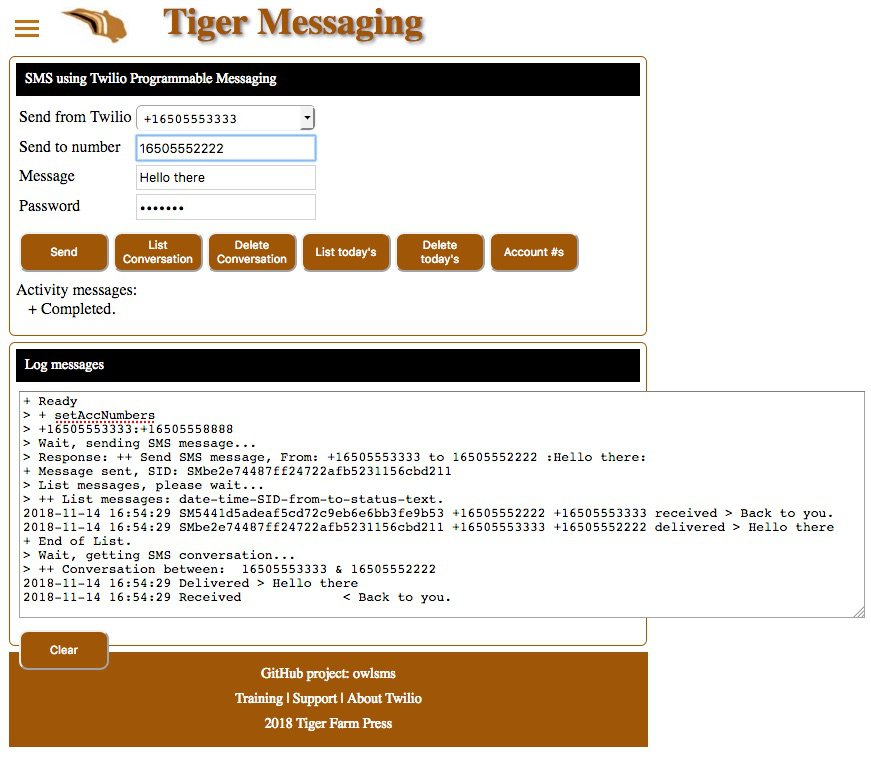

# SMS Application

If you would like an Heroku account to deploy and use this web application,
go to this [link (https://heroku.com)](https://heroku.com) and you can Sign up for free, and use it for free.

[](https://heroku.com/deploy?template=https://github.com/tigerfarm/owlsms)

When you deploy to Heroku, you will be prompted for an app name. 
The name needs to be unique. Example, use your name+hero (example: davidhero). 
Click Deploy app. Once the application is deployed, click Manage app. 
Set Heroku project environment variables by clicking Settings. 
Click Reveal Config Vars. Add the following key value pair:
````
ACCOUNT_SID=your_account_SID (starts with "AC")
AUTH_TOKEN=your_account_auth_token
TOKEN_PASSWORD : your_sms_password which you create for your users.
````
To redeploy,
````
To keep the same URL, remove the old app by using the Heroku dashboard:
    https://dashboard.heroku.com,
    Select the app, click Settings, go to the bottom, click Delete app.
Then, from, https://github.com/tigerfarm/owlsms, click Deploy to Heroku button.
Note, you will need to re-enter the above Config Vars.
````
SMS Application web browser screen print:



### Requirements:

- Twilio account. A free Trial account will work.
- To run locally on your computer using the include web server, install Node.JS and the Twilio Node.JS helper library.

## For Developers

## Files

- [index.html](index.html) : client HTML
- [owlsms.css](owlsms.css) : client styles, CSS
- [owlsms.js](owlsms.js) : client JavaScript
- [accountNumberList.php](accountNumberList.php) : Returns the Twilio account phone numbers and Messaging Services in a string.
- [accountPhoneNumbers.php](accountPhoneNumbers.php) : List the Twilio account phone numbers and Messaging Services using the environment's account SID.
- [sendSms.php](sendSms.php) : a program sends an SMS message.
- [smsConversation.php](smsConversation.php) : List SMS messages using the form's From and To phone numbers.
- [smsConversationDelete.php](smsConversationDelete.php) : Delete SMS messages using the form's From and To phone numbers.
- [smsListDateFilter.php](smsListDateFilter.php) : List SMS messages that were sent/received today. Note, uses UTC timezone.
- [smsListDateFilterDelete.php](smsListDateFilterDelete.php) : Delete SMS messages that were sent/received today. Note, uses UTC timezone.
- [nodeHttpServer.js](nodeHttpServer.js) : a NodeJS HTTP Server that serves the application static files and runs the PHP programs.
  This is used to run the client locally on a computer.
- [app.json](app.json) : Heroku deployment file to describe the application.
- [composer.json](composer.json) : Heroku deployment file which sets the programming language used.

## Local Host Setup

Following are the steps to run the SMS Web Application on your local host computer.

Download this repository's zip into a working directory and unzip it.
Create an environment variable that is your Twilio Function Runtime Domain.
Example:
````
$ export ACCOUNT_SID your_account_SID
$ export AUTH_TOKEN your_account_auth_token
$ export TOKEN_PASSWORD your_self_created_sms_password
````
You can view your Your Runtime Domain from here:
````
https://www.twilio.com/console/runtime/overview
````
Run the Node.JS server program:
````
$ node nodeHttpServer.js
````
### Test
````
Use your browser to use the client:
   http://localhost:8000
Enter the SMS form values.
Click Send to the message.
````

Cheers...
